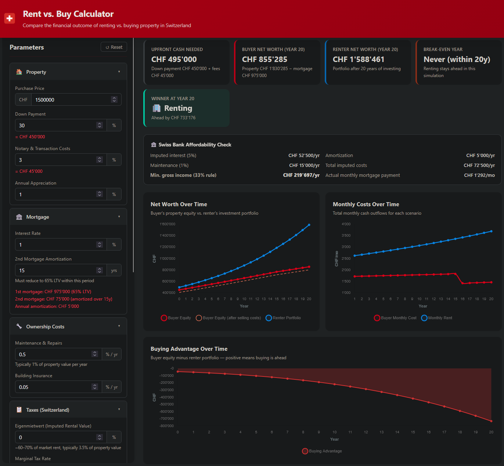

# 🇨🇭 Swiss Rent vs. Buy Calculator

A fully client-side web application that compares the long-term financial outcome of **renting** versus **buying** property in Switzerland. No server, no sign-up — just open `index.html` in your browser.

🌐 **Live demo:** [rent-or-buy-calculator.philippemaquin2705.workers.dev](https://rent-or-buy-calculator.philippemaquin2705.workers.dev/)
&nbsp;&nbsp;|&nbsp;&nbsp; **Source:** [github.com/Philippe2705/Rent-or-buy-calculator](https://github.com/Philippe2705/Rent-or-buy-calculator)



---

## Why This Exists

The rent-vs-buy decision is one of the most significant financial choices a person can make — and in Switzerland it is particularly complex:

- **Capital gains on investments are tax-free** in Switzerland, making stock portfolios an unusually attractive alternative to property equity.
- **Wealth tax** applies to both property equity and investment portfolios, affecting each scenario differently.
- The mandatory **20% minimum down payment** — often more in urban areas — locks up a significant amount of capital that could otherwise compound in an investment portfolio, making the opportunity cost especially meaningful.

Most generic online calculators ignore these Swiss-specific rules entirely. This tool models all of them, letting you stress-test your assumptions and understand the real trade-offs before making a decision.

---

## Features

### 🏠 Property & Purchase
- Configurable **purchase price**
- **Down payment percentage** with real-time CHF amount display
- **Notary & transaction costs** (canton-dependent, typically 2–5%)
- **Annual property appreciation** rate

### 🏦 Swiss Mortgage Model
- Automatic **1st / 2nd mortgage split** at the 65% LTV threshold
- **Mandatory amortization** of the 2nd tranche over a configurable period
- Actual vs. imputed interest rate comparison
- Real-time breakdown of monthly mortgage payment

### 🔧 Ownership Costs
- **Maintenance & repairs** as a percentage of property value (typically 1%/yr)
- **Building insurance** cost

### 📋 Swiss Tax Engine
- **Mortgage interest deduction** from taxable income
- **Maintenance deduction** from taxable income
- Configurable **marginal tax rate** (federal + cantonal + municipal combined)
- **Wealth tax** in per-mille (‰), applied to net property equity for the buyer and to the portfolio for the renter
- ~~Eigenmietwert~~ **Note:** the Swiss parliament voted to abolish the *Eigenmietwert* (imputed rental value) system for primary residences, effective **2029**. This calculator no longer models it; mortgage interest and maintenance deductions are retained.

### 📈 Opportunity Cost (Investment)
- Down payment and monthly cost differential invested in an **alternative portfolio**
- Configurable **gross total return** (e.g. global equity ETF)
- Configurable **dividend yield** — dividends taxed as income; capital gains remain **tax-free** per Swiss law
- Computes the **after-tax net return** automatically

### 🏢 Renting Scenario
- Monthly rent amount
- **Annual rent increase** rate (linked to the Swiss reference mortgage rate in reality)

### 📊 Affordability Check
- Swiss bank **5% imputed interest stress test**
- **33% gross income rule** — calculates the minimum income required to qualify for the mortgage

### ⏱️ Simulation
- Adjustable **time horizon** from 5 to 50 years via a live slider
- **Selling costs** on exit (agent commission, Grundstückgewinnsteuer, etc.) shown as a separate net equity line

---

## Visualizations

| Chart | Description |
|---|---|
| **Net Worth Over Time** | Buyer equity vs. renter portfolio, with a separate dashed line showing buyer equity net of selling costs |
| **Monthly Costs Over Time** | Total monthly cash outflows for each scenario as they evolve over the years |
| **Buying Advantage** | Green/red area chart — above zero means buying is ahead, below zero means renting is ahead |
| **Year-by-Year Table** | Full breakdown of property value, mortgage balance, equity, portfolio, monthly costs, and cumulative advantage; break-even year is highlighted |

---

## How the Model Works

### Buyer's net worth
```
Buyer Equity = Property Value − Remaining Mortgage Balance
```
Annual costs charged to the buyer: mortgage interest, amortization (cash outflow), maintenance, insurance, and net tax impact of deductions (mortgage interest + maintenance).

### Renter's portfolio
The renter invests the **entire upfront amount** (down payment + notary costs) on day one. Each month, the **cash flow difference** between the buyer's total outflows and the renter's total outflows is added to (or subtracted from) the portfolio, which compounds at the after-tax investment return.

```
Monthly contribution = (Buyer total monthly cost − Renter monthly cost)
Portfolio(t+1) = Portfolio(t) × (1 + monthly_return) + Monthly contribution
```

This means if buying is more expensive per month, the renter's portfolio grows faster, and vice versa.

### Break-even year
The year when `Buyer Equity ≥ Renter Portfolio` for the first time.

---

## Usage

1. Clone or download this repository.
2. Open `index.html` directly in any modern browser — no build step or server required.
3. Adjust the parameters in the left panel; all charts and figures update in real time.
4. Use the **↺ Reset** button to return to the Swiss-typical default values.

---

## Default Values

| Parameter | Default | Rationale |
|---|---|---|
| Property price | CHF 1 200 000 | Typical Swiss urban apartment |
| Down payment | 30% | 20% is Swiss minimum |
| Notary / transaction costs | 3% | Mid-range across cantons |
| Property appreciation | 1%/yr | Conservative long-run estimate |
| Mortgage rate | 1.5% | Current fixed-rate environment |
| Amortization period | 15 years | Legal maximum for 2nd tranche |
| Maintenance | 1%/yr | Swiss rule of thumb |
| Building insurance | 0.05%/yr | Typical building insurance premium |
| Marginal tax rate | 25% | Mid-range combined rate |
| Wealth tax | 3‰ | Mid-range cantonal rate |
| Monthly rent | CHF 2 500 | Equivalent property, urban CH |
| Rent increase | 1.5%/yr | Historical average |
| Investment return | 5%/yr | Global equity long-run average |
| Dividend yield | 2% | Typical diversified portfolio |
| Time horizon | 30 years | Long-term planning horizon |
| Selling costs | 3% | Agent + Grundstückgewinnsteuer |

---

## Tech Stack

- **Vanilla HTML / CSS / JavaScript** — zero dependencies, zero build tooling
- **[Chart.js 4](https://www.chartjs.org/)** — loaded from CDN for interactive charts
- Fully responsive layout, works on desktop and mobile

---

## Disclaimer

This calculator provides estimates for **educational and illustrative purposes only**. Tax rates, cantonal regulations, mortgage conditions, and market assumptions vary significantly and change over time. The model makes simplifying assumptions and does not constitute financial or legal advice. Always consult a qualified financial advisor, tax specialist, and notary before making real estate decisions in Switzerland.
